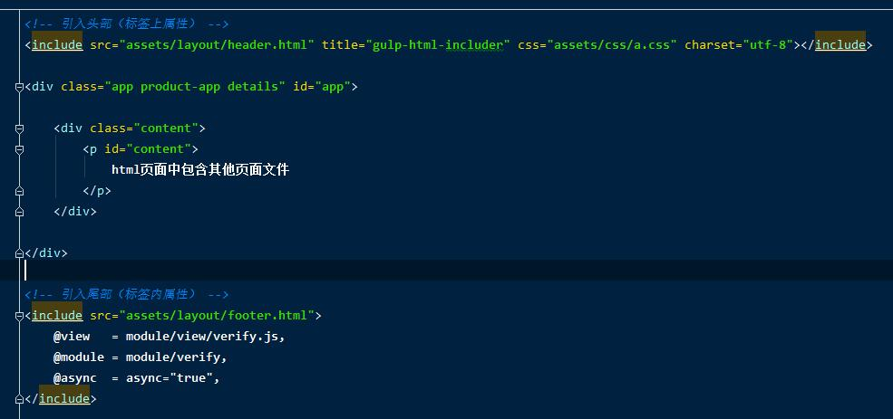
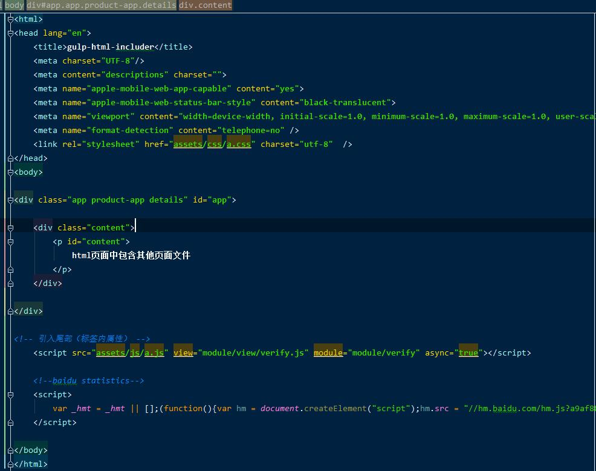
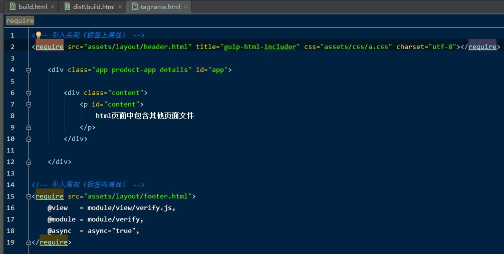
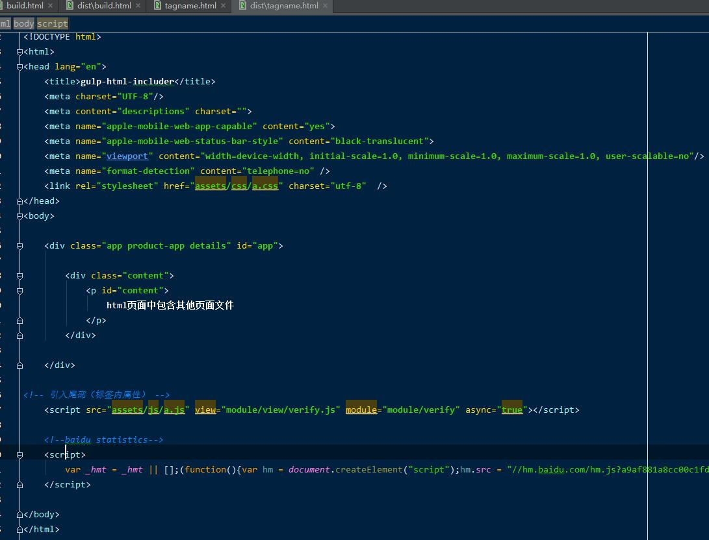

## Features

- HTML 页面中引入其他页面
- 引入时可带参数
- 递归引入

## Usage

```javascript
var gulp = require('gulp');
var htmlIncluder = require('gulp-tag-include');

gulp.task('build.html', function () {
  gulp.src('src/build.html').pipe(htmlIncluder()).pipe(gulp.dest('dist'));
});
```

## Html

```html
<!-- 引入尾部（标签内属性） -->
<include src="assets/layout/header.html">
  @title = gulp-html-includer, @css = assets/css/a.css, @charset = utf-8
</include>

<p>build</p>

<!-- 引入尾部 -->
<include src="assets/layout/footer"></include>
```

    + 也支持直接将变量作为标签属性的形式：

```html
<!-- 引入头部（标签上属性） -->
<include
  src="assets/layout/header.html"
  title="gulp-html-includer"
  css="assets/css/a.css"
  charset="utf-8"
></include>

<p>build</p>

<!-- 引入尾部 -->
<include src="assets/layout/footer"></include>
```

- 同时支持后台模版式：

```html
<!-- 引入头部（标签上属性） -->
@include("assets/layout/header.html", {title: "gulp-html-includer", css:
"assets/css/a.css", charset: "utf-8"} )
```

# header.html

```html
<html>
  <head lang="en">
    <title>{{ title }}</title>
    <meta charset="UTF-8" />
    <meta name="viewport" content="width=device-width, initial-scale=1.0" />
    <link rel="stylesheet" href="{{ css }}" charset="{{ charset }}" />
  </head>
  <body></body>
</html>
```

# footer.html

```html
    </body>
    </html>
```

# output

```html
<html>
  <head lang="en">
    <title>gulp-html-includer</title>
    <meta charset="UTF-8" />
    <meta name="viewport" content="width=device-width, initial-scale=1.0" />
    <link rel="stylesheet" href="assets/css/a.css" charset="utf-8" />
  </head>
  <body>
    <p>build</p>
  </body>
</html>
```

## Options

```javascript
gulp.task('build.html', function () {
  gulp
    .src('src/build.html')
    .pipe(
      htmlIncluder({
        //匹配引入标签名
        tagName: 'require_once',
        //处理标签上的属性参数传递，默认 true
        tagAttr: true,
        //处理标签内容中的参数传递，默认 true
        tagContent: true
      })
    )
    .pipe(gulp.dest('dist'));
});

//gulp.task('default', ['build.html']);
```







# options

    + tagName; (匹配引入标签名)
    + tagAttr; (处理标签上的属性参数传递，默认 true)
    + tagContent; (处理标签内容中的参数传递，默认 true)
    + compress; (是否对css和js进行压缩处理，默认 true)
    + globals; (全局配置参数，必须是[object Object]对象)

# License

ISC
